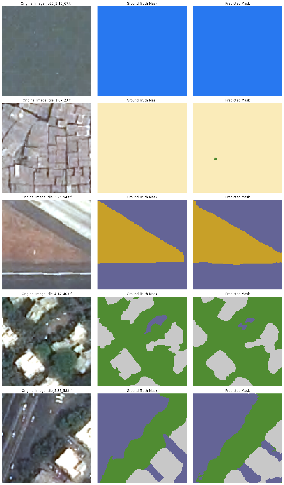

# CS2831_Final_Project

Semantic segmentation of aerial images taken from [Manually Annotated High Resolution Satellite Image Dataset of Mumbai for Semantic Segmentation](https://data.mendeley.com/datasets/xj2v49zt26/1)

Utilizes the U-Net architecture through the [Segmentation Models PyTorch Library](https://github.com/qubvel-org/segmentation_models.pytorch)

An example segmentation is given below:

